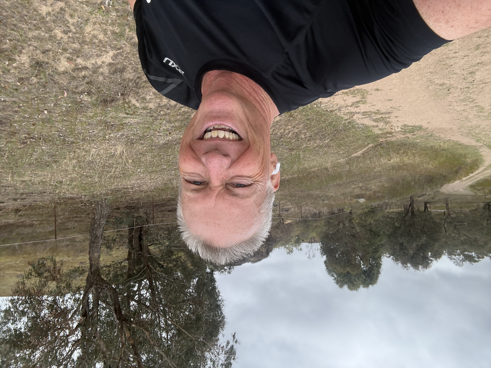

***Creative Writing With AI
Progress Updates
Monday, January 12, 2026
Tough run. Midday heat, I'm still feeling a bit sick, and my running form has gone to hell in an F45 handbasket. The run was on the Mt. Ainslie Park Run course. 

Stats
Distance: 5k
Surface: Mildy undulating trail
Temp: 27c
Vertical: 74m
Conditions: Direct sun, light breeze
Body: horrible form, sore quads at finish
Link: https://www.strava.com/activities/17018813234

Wednesday, January 14, 2026
Much better running conditions...0530, not hot, no wind. I chose to do laps of the "Ken's Chair" loop, because of the climb, drop, climb sequence. Bit of tightness in BOTH hamstrings at the start, but loosened up by the 2nd kilometre. While form isn't 'back' per say, it is much better. 

Stats
Distance: 5.27k
Vertical: 94m
Surface: Mildy undulating trail
Temp: 16c
Conditions: Dawn, no wind
Body: Tight hamstrings, no other issues
Link: https://www.strava.com/activities/17038230557

Saturday, January 17, 2026
And I'm back...timing, comfortability, everything seems to have fallen just where I left it. Conditions were windy, with a bit of sideways mizzle. 

Ran the Coolemon Ridge with Mt. Arawang climb...pretty much my standard 10k, featuring 3 nice climbs and lots of good runnable bits. A little niggle on the left outer shin, but nothing that didn't work out with time. Feeling a bit stiff tonight, and will try to get an F45 in tomorrow morning. 

Stats
Distance: 10.33k
Vertical: 344m
Surface: Firetrail + Single Track
Temp: 16c
Conditions: 10 am, strong wind, light rain.
Body: Feeling good!
Link: https://www.strava.com/activities/17075419266

Reach out to me if you'd like to join in on a run (very slow) or have any other comments.